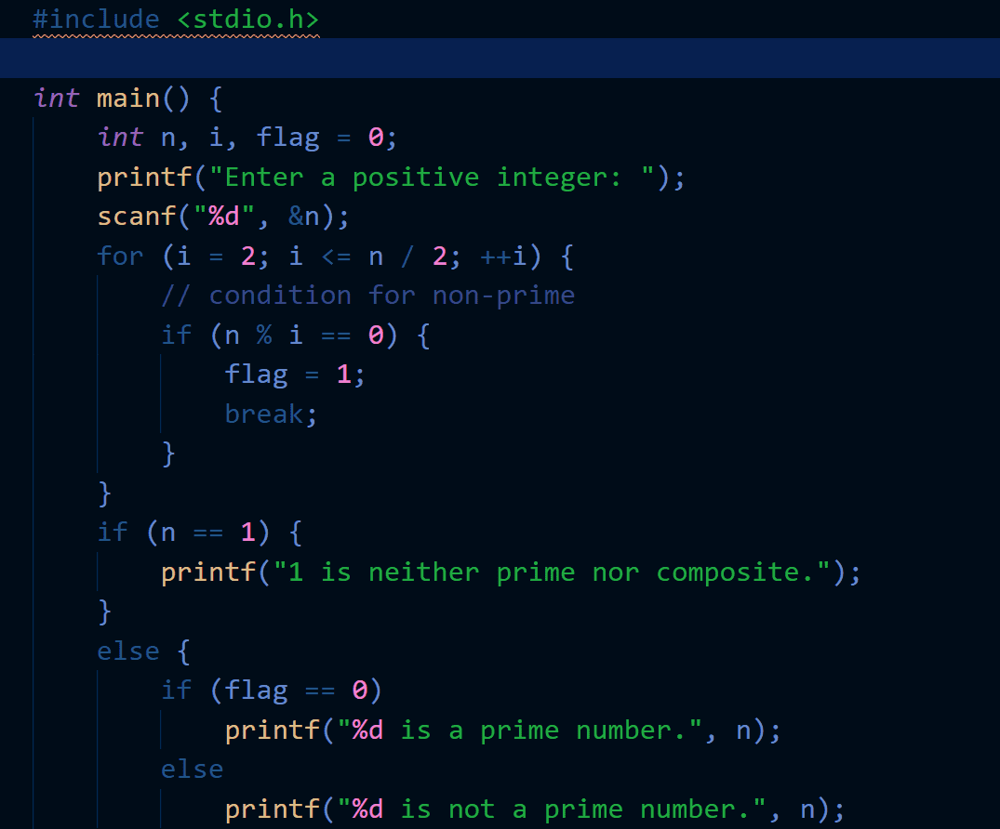
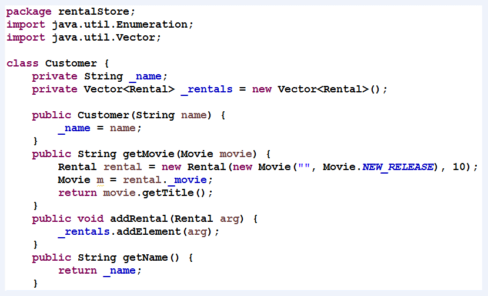
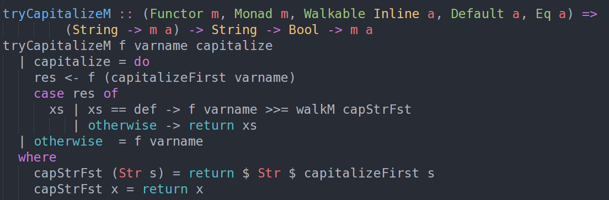

# Paradigmas de programação

## O que são?

Paradigma de programação é um meio de classificar as linguagens de programação baseado em suas funcionalidades. Um paradigma diz quais estruturas usar e quando usá-las, determinando a visão que o programador terá sobre a estruturação e a execução do programa.

Aqui estarei me atentando ao que julgo ser os três principais paradigmas de programação e quando suas utilizações são adequadas.

## Programação Estruturada

A programação estruturada foi "proposta" por Edsger Wybe Dijkstra em 1968. Em contraste com a programação não-estruturada, Dijkstra nos mostrou que o uso desenfreado de desvio de fluxos (por instruções `goto`) era perigoso para a estrutura do programa, sobretudo, quando temos a intenção de provar a corretude de algoritmos matematicamente.

Durante sua investigação, Dijkstra percebeu que certos usos de instruções `goto` impediam que módulos de código fossem decompostos recursivamente em unidades menores, e que portanto uma prova por meio de uma abordagem de dividir-e-conquistar era impossível nesses casos.

Outros usos da instrução `goto` no entanto não tinham esse problema. Dijkstra percebeu que esses "bons" usos do `goto` correspondiam à simples estruturas de controle e iteração como `if/then/else` e `do/while`. Módulos que usavam apenas esses tipos de estrutura de controle poderiam ser recursivamente subdivididos em unidades prováveis.

Abordagens para construção de algoritmos de forma estruturada estão presentes em praticamente todas as linguagens de programação multi-paradigma, e de certa forma, normalmente somos ensinados a programar primeiramente em uma linguagem estruturada, como *C* ou *Pascal*. Via de regra, a programação estruturada é a forma padrão na qual construímos algoritmos.

## Programação Orientada a Objetos

A programação orientada a objetos pode ser definida de várias formas e vejo que muitas vezes os autores chegam a divergir um pouco nessa definição. Particularmente, me agrada a definição de que, _"POO é um modelo de análise, projeto e programação de software baseado na composição e interação entre diversas unidades chamadas de objetos"_, somado a isso, acredito que uma linguagem orientada a objeto deve ainda possuir por sua natureza as capacidades de encapsulamento, herança e polimorfismo.

As linguagens de programação mais utilizadas hoje em dia são multi-paradigma com suporte à POO. Grande parte da nossa literatura sobre engenharia de software e as boas práticas consolidadas em clareza de código e arquitetura, tem como base os princípios da orientação a objeto.

É extensamente utilizada em softwares comerciais e é apropriada para construção de uma enorme gama de sistemas.

## Programação Funcional

O paradigma de programação funcional começou a ser mais fortemente adotado recentemente, porém foi o primeiro a ser inventado. Na realidade, sua invenção antecede a própria programação de computadores. A programação funcional é resultado direto do trabalho de Alonzo Church, que em 1936 inventou o λ-calculus enquanto procurava resolver o mesmo problema matemático que Alan Turing, na mesma época. Uma noção fundamental do λ-calculus é a imutabilidade - ou seja, a noção de que as variáveis declaradas não mudam, sendo portanto constantes.

O processamento de dados em linguagens funcionais ocorre por sua vez utilizando transformações (funções) sobre os dados.

Atualmente temos vários cases de empresas que utilizam programação funcional nos seus produtos, em especial no Brasil algumas _Fintechs_. Podemos citar como principais vantagens, a resolução de problemas de computação paralela, como problemas de concorrência, código mais enxuto e objetivo, garantindo eventualmente uma fácil manutenção, e também simplicidade na hora de isolar funções para testes.

